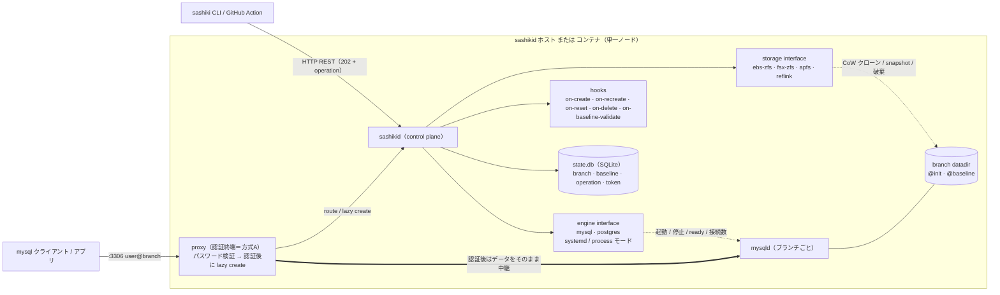

# sashiki

  

> **成熟度**: public preview。MySQL + GitHub PR プレビューの経路は実機で検証済み。
> API / config は**まだ固定していない**(マイナー版で破壊的変更があり得る)。本番 DB には使わない。

**開発環境向けの、ブランチできる RDS。**

本番相当のサイズ・中身の MySQL / PostgreSQL を、Git のブランチのように**数秒で作って・壊して・戻せる**。
Copy-on-Write クローン(Linux は ZFS、**macOS は APFS `clonefile`**)を使うので、何 GB のデータベースでも複製は数百 KB。
Linux(EC2 / ZFS)でも **Mac ネイティブ(VM 無し)** でも動く。
PR プレビュー・CI・開発者 sandbox・マイグレーション検証——非本番で「独立した DB がすぐ欲しい」場面のためのセルフホスト基盤。

```console
$ sashiki create pr-123
branch 'pr-123' ready: mysql -udev@pr-123 -h 127.0.0.1 -P3306

$ sashiki reset  pr-123    # 壊しても数秒で作成時点に戻る
$ sashiki recreate pr-123  # main が進んだら最新 baseline から作り直す
$ sashiki delete pr-123    # 用が済んだら消す
```

API が返す接続先は config の `domain` なので、クライアントから解決できる名前または IP を設定する。Terraform は Route53 未指定時に private IP、macOS init は `sashiki.local` を使う(`.local` の mDNS と衝突する環境では変更する)。

- 複製は **CoW なのでコピーしない**。クローン直後のディスク消費は数百 KB
- ブランチは完全に分離。`DROP TABLE` しても他ブランチとベースは無傷
- 実データ量でマイグレーションをレビューできる(本番で長時間ロックする ALTER が事前に見つかる)
- メモリを使うのは動いている mysqld だけ(ホストは常時 1 台動く)。アイドルブランチは自動停止し、proxy 経由の再接続で起きる

背景と実測: [EBS 版 PoC](https://rikuka.dev/blog/db-branch-zfs-mysql-poc/) / [FSx 版検証](https://rikuka.dev/blog/db-branch-fsx-openzfs/) / [PoC から OSS へ(設計とアーキテクチャ)](https://rikuka.dev/blog/db-branch-sashiki-oss/)

> **これは本番 DB の置き換えではありません。** 非本番(preview / CI / dev)向けの、使い捨て DB を配る基盤です。単一ノード構成で HA/レプリカは持ちません。詳しくは [向かない用途](#向かない用途)。

---

## 何に使える

| 用途 | profile | 使い方 |
|---|---|---|
| **PR プレビュー環境** | `preview` | GitHub Action が PR open/reopen/synchronize で create / close で delete |
| **CI の分離 DB** | `ci` | ジョブごとに create、短い TTL で自動回収 |
| **開発者の sandbox** | `sandbox` | 手元から `create`、長めに保持 |
| **マイグレーション検証** | 任意 | 実データ量で ALTER を試す。壊したら `reset` |
| **RDS / Aurora の非本番用置き換え** | — | Terraform モジュールで 1 apply(主要な変数名・出力名を RDS / Aurora モジュールに揃えてある)。※非本番のみ |

profile は用途ごとの寿命(idle 停止 / 自動削除)を表す。`create --ttl 7d` や `lease renew` で期限も付けられる。

## Git との対応

| Git | sashiki |
|---|---|
| main HEAD | current baseline |
| `git branch` | `sashiki create` |
| `git reset --hard` | `sashiki reset` |
| `git rebase main` | `sashiki recreate` |
| `git branch -D` | `sashiki delete` |

---

## 使ってみる

環境に応じて 2 経路:

- **Linux(Ubuntu 24.04, EC2 等)** — ZFS バックエンド + systemd。本番寄りの構成。以下の手順。
- **macOS ネイティブ(VM 無し, v0.4〜)** — APFS `clonefile` + mysqld 直起動。下の [macOS ネイティブ](#macos-ネイティブvm-無し) を参照。
  (Lima VM や git worktree 連動が要る場合は [docs/LOCAL-DEV.md](docs/LOCAL-DEV.md))

### 1. インストール

```bash
# 最新 release を取得して導入(Linux=deb / macOS=tar.gz を自動判別。release の checksums.txt で sha256 を照合)
curl -fsSL https://raw.githubusercontent.com/rikukadev/sashiki/main/install.sh | sudo bash
```

### 2. 初期化

```bash
# パッケージ導入・AppArmor・sudoers・zpool/データセット・systemd・config 生成まで冪等に
sudo sashiki init --pool dbpool --device /dev/nvme1n1   # デバイス名は lsblk で確認
```

`sashiki init` は構成済みのステップをスキップするので、何度実行しても安全。

### 3. baseline(元データ)を入れる

```bash
# ダンプから baseline を作る(投入 → 正常終了 → snapshot 取得まで)。ZFS 操作のため root
sudo sashiki baseline import --from prod-dump.sql
```

baseline は **build → validate → publish** の 3 段階。検証に落ちた候補は current にならないので、
壊れた migration が入っても新規ブランチは無傷。`baseline set` で直前の正常版に即ロールバックできる。
本番データを使うなら **PII マスキング**を build に組み込み、`require_masked` を有効にすれば未マスクは publish できない。

あるブランチで migration を当てて検証できたら、その状態をそのまま次の baseline に昇格できる(git の branch→main 相当):

```bash
sashiki baseline promote pr-123   # pr-123 の現在の datadir を新しい current baseline に
```

`promote` は snapshot 不変条件のため対象ブランチを一度 graceful stop し、昇格後に再起動する(既存の他ブランチの origin は変えない)。
promote も refresh と同じ publish ポリシーを通る: `_validate` で起動検証(`on-baseline-validate` があれば実行)し、
落ちたら登録だけ残して current にはしない。`require_masked` を有効にしているなら、ブランチのデータが
マスク済みであることを **`--masked` で宣言**しないと拒否される(branch 上の操作は sashiki からは見えないため自動判定しない)。
promote したブランチは新 baseline の**実体**(snapshot)を保持するので、別の baseline を
promote / set するまで **reset / recreate / delete は 412 で拒否**される(`list` では `!`、
`show` では `baseline:` 行で分かる)。「promote → そのブランチで作業を続ける」なら、
先に `recreate` で新 baseline から作り直したブランチを使う。

### 4. ブランチを払い出す

```bash
sudo systemctl enable --now sashikid
sashiki create pr-1
mysql -udev@pr-1 -p -h 127.0.0.1 -P3306   # :3306 固定エンドポイント経由で接続
```

パスワードは `init` がランダム生成して表示したもの(`/etc/sashiki/config.yaml` の `app_pass`)。
固定したいときは**手順 2 の `init` に `--app-pass <値>` を付ける**(config があると `init` は
生成ステップを飛ばすので後から付けても効かない。後から変えるなら config の `app_pass` と
baseline 内のユーザーのパスワードを両方変える)。macOS ネイティブとコンテナは開発用途なので
既定 `dev`(`init --app-pass` で変更可)。

### macOS ネイティブ(VM 無し)

フル VM も ZFS カーネル拡張も無しで、Mac 上で直接動かせる(v0.4〜)。
ストレージは **APFS `clonefile`**、mysqld は **systemd を使わず直接 spawn**(process モード)。

```bash
brew install mysql         # 版は問わない(8.0 / 8.4 / 最新のいずれでも可)。app_user の
                           # プラグインは backend の版を見て自動で選ぶので、native を
                           # 廃止した版でも 8.0 を入れ直す必要はない。
                           # 実機検証: 8.0 / 8.4 / 26.7(native 廃止世代)。
                           # MySQL 5.7 は best-effort(EOL・未検証。native を選ぶ)。
                           # MariaDB は native を選ぶが他挙動が未検証のため非対応。
curl -fsSL https://raw.githubusercontent.com/rikukadev/sashiki/main/install.sh | bash
sashiki init --platform darwin --yes   # mysqld 検出・base 初期化・baseline・config・launchd 常駐
sashiki create pr-1
mysql -udev@pr-1 -pdev -h 127.0.0.1 -P3306
```

`init --platform darwin` は root 不要。既定のルートは `~/Library/Application Support/sashiki`
(Postgres は `sashiki-pg`、API は `:8081` なので MySQL 版と同時に常駐できる。`--root` で変更可)。`baseline import` / `token` などの CLI は
そこにある `config.yaml` を自動で使う(`--config` / `SASHIKI_CONFIG` で上書き可)ので、
Linux 手順と同じコマンドがそのまま通る。ただし **MySQL 版と Postgres 版を両方 init した場合や
`--root` を変えた場合は自動検出しない**ので、`--config <path>` か `SASHIKI_CONFIG` で指定する。
`init` が作った空の baseline は残り、
`baseline import --from dump.sql` は新しい tag で取って current を切り替える。
`sashiki token` も darwin では root 不要。詳細と Lima/worktree 連動は [docs/LOCAL-DEV.md](docs/LOCAL-DEV.md)。

macOS ネイティブの運用メモ:
- **root は APFS 上に置く**(clonefile は APFS でしか効かない。`init` が確認して、外付けの exFAT などなら止まる)。`init` は root を **Time Machine の対象から外す**(バックアップ先では CoW が保てずフルサイズで複製されるため)
- sashikid は **LaunchAgent**(ログイン中だけ動く。`KeepAlive` なので kill しても復活する)。止めるのは `launchctl unload ~/Library/LaunchAgents/dev.sashiki.sashikid.plist`(Postgres 版は `…sashikid-pg.plist`)。ログは `<root>/log/sashikid.{out,err}.log`
- branch の mysqld / postgres は sashikid を止めても動き続ける(意図的)。sashikid は起動時に pidfile とプロセス名で再認識する
- graceful stop は最大 10 分待つ(buffer pool が大きいと停止に時間がかかる)

> 実測(20GB baseline, Apple Silicon): create 1〜3s / reset 1.3〜2.5s / recreate 〜3.5s。

### コンテナ(VM 無し)

Docker 互換のランタイム(Docker / Docker Desktop / OrbStack / Colima など)があれば、
Mac でも Linux でもコンテナだけで完結する。ストレージは **XFS reflink**(CoW)、
mysqld は **process モード**(systemd 不要)。ZFS カーネル拡張も要らない。

```bash
git clone https://github.com/rikukadev/sashiki && cd sashiki
./deploy/orbstack/build.sh                                    # sashiki/sashikid を linux にクロスビルド
docker compose -f deploy/orbstack/compose.yaml up --build -d  # 起動(baseline も自動構築)
mysql -udev@pr-1 -pdev -h 127.0.0.1 -P 13306                  # 未知ブランチは proxy で lazy create
```

- 起動時にコンテナ内へ loopback の **XFS(`reflink=1`)** 領域を用意し、`schema.sql` から
  baseline を自動構築して `sashikid` を常駐させる。CoW が効かない FS は起動時に検出して即停止する。
- 要件: `privileged`(loopback FS のマウント用)と reflink 対応 FS。ホストの OS は問わない。
- ポート: REST / Web UI が `:8080`、proxy が `:3306`(compose ではホスト側の衝突回避で
  `13306:3306` に割り当て済み。上の例が `-P 13306` なのはこのため)。
- データ: ブランチ・baseline(XFS イメージ)・state.db・config は named volume `sashiki-xfs`
  に置く。`docker compose down` では残り、`down -v` で消える。XFS のサイズは初回のみ
  `XFS_SIZE_MB`(既定 2048)で決まる。
- API はコンテナ外(ホスト)から見ると loopback ではないので、CLI / Web UI をホストから
  使うには `SASHIKI_API_TOKEN` が要る(`docker compose exec sashiki sashiki token create --name dev`)。

ディレクトリ名は歴史的経緯で `deploy/orbstack/` だが、**特定の製品に依存しない**
(Docker 互換ランタイム全般で動く)。詳細は [deploy/orbstack/README.md](deploy/orbstack/)。

---

## 認証(トークン)

API(= sashikid)への認証は「**ローカルは素通し、外から叩くときだけトークン**」。

- **同じホストからの CLI** — 不要。sashikid は loopback からのリクエストを無認証で通す。ホスト上で `sashiki create ...` はそのまま動く。
- **ホスト外(CI / GitHub Action / リモート CLI)** — **Bearer トークンが必要**。

### 誰が発行するか

トークンは **sashiki を運用する人(sashikid ホストに root で入れる人)** が発行する。2 通り:

| 方法 | 発行者 | 保存/配布 |
|---|---|---|
| **手動** | ホスト上で root が `sudo sashiki token create --name ci` | **平文は 1 回だけ表示**(DB には SHA-256 ハッシュのみ)。表示された値を利用側へ配る |
| **Terraform** | モジュールが `random_password` で生成 | SSM SecureString(出力 `api_token_ssm_path`)に保存。利用側は SSM から取得 |

### トークンで何ができるか(scope)

| scope | できること | 想定 |
|---|---|---|
| `branches`(`token create` の既定) | ブランチの create / reset / recreate / delete / retry / lease / sleep / wake、一覧・詳細・operation・capacity の読み取り | CI / GitHub Action に配る |
| `admin` | 上に加え、baseline の build / validate / publish / set / promote / delete / gc、`drain`、`gc --orphans`、**データブラウザ(任意 SQL)**、hook の手動実行 | 運用者 |

loopback からの無認証アクセスと、`SASHIKI_API_TOKEN` 環境変数で渡すトークン(Terraform 生成)は `admin`。
CI に配るのは `branches` にしておくと、GitHub Secrets が漏れても baseline の差し替えや
任意 SQL(app_user は MySQL `GRANT ALL` / Postgres `SUPERUSER` なので OS コマンド実行に等しい)までは届かない。
データブラウザと hook 手動実行は「誰が何を流したか」を sashikid のログに残す。

### どう使うか(利用側)

CLI / Action は次のどちらかでトークンを読む(env が優先):

```bash
export SASHIKI_API_TOKEN=sashiki_xxxxxxxx        # 環境変数、または
printf '%s' "$SASHIKI_API_TOKEN" > ~/.config/sashiki/token   # ファイル

SASHIKI_API_URL=https://sashiki.example.com sashiki list      # 外から叩く
```

GitHub Action なら `secrets.SASHIKI_API_TOKEN` を渡すだけ(下の使い方 B)。

- サーバー側は、起動時に `SASHIKI_API_TOKEN` で渡した 1 個(後方互換)か、`sashiki token` で発行した state.db のトークン(ハッシュ照合)を検証する。
- ローテーションは **新規発行 → 配布先を差し替え → 旧トークンを `sashiki token revoke`**。
- `GET /v1/healthz` と Web UI の HTML(`GET /`)は認証なしで返す(LB のヘルスチェック用 / UI がトークンを入力させるため)。Web UI は 401 を受けるとトークン入力欄を出し、`Authorization` ヘッダで API を叩く(タブの sessionStorage に保存)ので、`trust_loopback: false` でも使える。データブラウザは admin スコープが要る。
- `listen.metrics`(既定 `127.0.0.1:9100`)は**認証なし**。ブランチ名・容量が見えるので、loopback 以外で開くなら到達元をネットワークで絞る(起動時に警告を出す)。
- ⚠️ 認証免除は「接続元が loopback か」で判定する。**リバースプロキシ越しに公開すると接続元が 127.0.0.1 に見えて素通しになる**ため、外部公開時は sashikid を直接 listen させるか、**`auth.trust_loopback: false`** を設定して loopback でも Bearer トークンを必須にすること。Bearer で認証した要求はデータブラウザの Origin / Host 検査も免除されるので、`trust_loopback: false` + リバースプロキシ(Host が公開名)でもデータブラウザは使える。

### proxy(:3306)側の既定値

API とは別に、DB クライアントが繋ぐ proxy は **app パスワード 1 つ**で認証を終端する。既定の組み合わせを知っておくこと:

- `listen.proxy: 0.0.0.0:3306` — 全 IF で待つ。SG / ファイアウォールで到達元を絞る
- `branches.lazy_create: true` — **未知のブランチ名で接続すると、認証後にそのブランチを作る**(`max_branches` まで)。Action で明示的に create する運用なら `false` にできる
- `app_pass` — Linux の `init` はランダム生成、macOS / コンテナは `dev`。パスワードを知る人は誰でも lazy create できるので、`dev` のまま外に出さない
- 認証失敗が続く接続元は次の試行を**検証の前に**待たせる(5 回まで即時、以降 1s → 8s)。同時に**検証中**の試行は接続元ごとに 8 まで(認証が済んだセッションは数えない)。正しいパスワードで通れば解除

## 3 つの使い方

### A. CLI から

```bash
sashiki create demo --profile sandbox --ttl 7d
sashiki create demo --exist-ok       # 既にあれば既存を返す(毎回走る hook 向け)
sashiki list
sashiki show demo --json
sashiki env demo                     # DB_HOST= / DB_PORT= / DB_USER=(dotenv)
sashiki reset demo
sashiki lease renew demo --for 14d   # 期限を延ばす
sashiki drain                        # メンテ前に全ブランチを安全停止
sashiki delete demo
```

コマンド・フラグ・終了コードの一覧は [docs/REFERENCE.md](docs/REFERENCE.md#cli)。

`--exist-ok` と `env` は、**毎回走る仕組みから呼ぶ**ためのもの。
`--exist-ok` が無いと 2 回目の create が 409 で落ちるので、呼び出し側は
`|| true` で **実エラーまで握り潰す**回避に追い込まれる。`env` は
`show --json | jq` の配管を各所に書かせないためで、環境変数として渡す先
(CI・アプリ)が求めるのは JSON ではなく `KEY=VALUE` だから。

同じブランチに実行中の変更操作(create / reset / recreate / retry / delete)があるあいだ、
次の変更は **409 `operation_in_progress`**(CLI は終了コード 4)で断る。`--wait`(既定)で
完了を待ってから次を叩けば当たらない。`sashiki doctor` / `gc --orphans` は状態を読むだけで、
実行中の操作を書き換えない(中断の回収は sashikid の起動時だけ)。sashikid は停止時に
実行中の操作を最大 10 分待つ。

`env` が出すのは **そのまま繋がる 3 つ組**(host / port / user)だけ。
内部ポート(`engine_port`)は調査用なので混ぜない。パスワードも出さない —
払い出し対象ではないし、「表示しただけ」のつもりの操作が CI のログに
秘密を残すことになる。

### B. GitHub Action(PR プレビュー)

```yaml
- uses: rikukadev/sashiki/action@v0.11.0 # x-release-please-version
  with:
    api_url: ${{ vars.SASHIKI_API_URL }}
    token:   ${{ secrets.SASHIKI_API_TOKEN }}
    profile: preview
    on_close: delete    # PR close でブランチ削除
    comment: "true"     # 接続先(host/port/user)を PR にコメント
```

PR の open / reopen / **synchronize(push)** で create(既にあれば既存を返す)、close で delete(既に無ければ成功扱い)。
それ以外のイベント(`labeled` など)は何もしない。接続情報(`host` / `port` / `user`)を出力するので
プレビュー環境の env にそのまま渡せる。`comment: "true"` には `pull-requests: write` 権限が要る。
close を取りこぼしても消えるよう `--ttl` や profile の `delete_after_idle` と併用する。
ref はタグで固定する(`@main` は未リリースの変更を拾う)。入力の一覧は [action/README.md](action/README.md)。

### C. Terraform(RDS を選ぶところで sashiki を選ぶ)

```hcl
module "db" {
  source = "github.com/rikukadev/sashiki//deploy/terraform?ref=v0.11.0" # x-release-please-version

  name           = "myapp-preview"
  vpc_id         = var.vpc_id
  subnet_ids     = var.private_subnet_ids
  allowed_sg_ids = [aws_security_group.app.id]

  instance_class    = "m6i.large"    # RDS と同じ変数名
  allocated_storage = 100
}
# 出力: endpoint / port / username / password_secret_arn / api_url ...(RDS/Aurora モジュールと同名)
```

> **バージョンの固定**: `source` の `?ref=` を**バージョンタグ**にすれば、`sashiki_ref`(install.sh の
> 取得元 = バイナリ版)はモジュール同梱の `VERSION` から**自動で同じタグに一致**する(#199)。
> `?ref=main` や、別のバイナリ版を使いたいときだけ `sashiki_ref = "vX.Y.Z"` を明示する。

EC2 + EBS(prevent_destroy)+ SG + IAM + Route53 + Secrets/SSM を 1 apply。
apply 完了時点で sashikid が稼働する。詳細は [deploy/terraform/README.md](deploy/terraform/)。

出力 `api_url` は **http**(TLS 終端なし)で、`allowed_sg_ids` の SG からだけ届く。
VPC 外(GitHub-hosted runner 等)からは Action の `transport: ssm` を使う。
Route53 レコードは `route53_zone_id` と `dns_name` を両方渡したときだけ作られ、
渡さなければ `endpoint` は private IP になる。

> **インスタンスを差し替えてもブランチデータは残る**(#246)。EC2 が作り直されても
> (`terraform apply -replace` など)、データ EBS は `prevent_destroy` で保持される。
> ※ `ami` は `ignore_changes` なので AMI の更新では作り直されず、`user_data` の変更も既定では
> in-place(再実行されない)。インスタンスを入れ替えるときは明示的に `-replace` する。
> state.db は root volume 上にあるので、入れ替え後の台帳の扱いは [#275](https://github.com/rikukadev/sashiki/issues/275) を参照。新しいインスタンスの
> `sashiki init` は **既存の zpool を検出して `import` し、そのまま再利用する**(pool が無い
> ときだけ `zpool create`)。ブランチも baseline もそのまま使える。
> ※ import は `-f` 付き(インスタンス差し替えで hostid が変わるため)。EBS は 1 台にしか
> attach されないので、他ホストと同時にマウントする事故は起きない。

モジュールは MySQL 専用(Postgres を選ぶ変数は無い)で、データ EBS の暗号化指定とバックアップ(snapshot)は
していない。`prevent_destroy` は「消えない」保証で「戻せる」保証ではないので、要るなら AWS Backup 等を別途掛ける。
MySQL の版は AMI の apt パッケージで決まる。未使用だった `engine_version` 入力は、指定すれば版が変わるという誤解を避けるため削除した。

---

## 機能

- **branch lifecycle**: create / reset / recreate / delete / retry(create / reset / recreate / wake が途中で失敗したブランチを `error` から再実行。残骸は掃除して origin から作り直す)
- **profile / lease**: 用途ごとの idle lifecycle(preview / ci / sandbox)+ `--ttl` / `lease renew` の絶対期限
- **proxy(:3306 固定エンドポイント)**: `mysql -udev@<branch>` でルーティング。**認証終端(方式A)**——sashiki がパスワードを検証し、**認証後に** lazy create(認証前のリソース確保を防ぐ)。TLS 終端対応(`proxy.tls_cert` と `proxy.tls_key` の両方。未設定だと `--ssl-mode=REQUIRED` のクライアントは繋がらない)
- **アイドル管理**: 無接続で mysqld 停止(`sleeping`)、proxy 経由の再接続で起床。idle は「作成時刻と最後の接続の新しい方」から数える(作って一度も繋がなければ作成時刻から)。engine ポーリング(MySQL は `mysql` クライアント、Postgres は `psql`)で接続を追跡するので proxy を通らない直結も「使用中」と判定する。ポーリングに失敗し続けるブランチは使用中として保護され回収されない(ログに警告)。TTL / lease で自動削除
  - 起床は proxy の認証中に同期で行う(クライアントの接続は最大 60 秒待つ)。起床時にもメモリ / storage の admission が走り、足りなければ起きない。失敗理由はクライアントには `Unknown branch` としか見えないので sashikid のログを見る

> **セキュリティ:** branch ごとの MySQL ポート(`3401-3600`)は内部用で、既定では
> `127.0.0.1` にだけ bind する。外部クライアントには認証終端の proxy(`3306`)だけを
> 公開し、branch ポートを Security Group・ファイアウォール・ポート転送で公開しないこと。
- **baseline**: build → validate → publish。PII マスキングを必須化できる。`baseline set` で即ロールバック、`baseline promote` で検証済みブランチを次の baseline に昇格
- **capacity 管理**: メモリ admission(不足時は新規を拒否して既存 mysqld を OOM から守る)、storage watermark、`sashiki capacity`
- **運用**: 起動時 reconciliation、`sashiki doctor`、orphan GC、`sashiki drain`、構造化ログ + Prometheus メトリクス、Web UI
- **engine**: MySQL / PostgreSQL。起動は systemd(既定)または **process モード**(mysqld 直起動、systemd の無い macOS / コンテナ向け)
- **storage backend**: EBS + ZFS(Linux 既定、秒単位の UX)/ FSx for OpenZFS(storage と compute の分離)/ **APFS clonefile**(macOS ネイティブ)/ **XFS reflink**(コンテナ)

## アーキテクチャ



- **storage** と **engine** はインターフェース。バックエンドは `Capabilities`(FastRollback / TypicalCreate / ClonesAreDistinct)を宣言し、コアが挙動を切り替える(zfs の rollback は数秒、FSx は再クローン方式——同じ「reset」でも実装が変わる)
- **@init / @baseline スナップショットは必ず mysqld の正常終了状態でのみ取得する**。破るとブランチ起動のたびに InnoDB クラッシュリカバリが走る(設計全体で最も重要な不変条件)
- 自社固有の処理(マイグレーション適用・データマスク)はコアに入れず **hooks** に追い出す。hook は `on-create` / `on-recreate` / `on-reset` / `on-delete` / `on-baseline-validate` の 5 つ(baseline の build は `baseline.refresh_script` か `source_dir`)。`on-delete` は DB を止めた後に走る(最終ダンプには使えない)。`on-reset` / `on-delete` の失敗は記録して続行する

設計仕様は [docs/SPEC.md](docs/SPEC.md)、設計判断(ADR)は [docs/DECISIONS.md](docs/DECISIONS.md)、コスト比較は [docs/COSTS.md](docs/COSTS.md)。
CLI / HTTP API / hooks の環境変数 / Action の入力 / Terraform の変数 / config の一覧は [docs/REFERENCE.md](docs/REFERENCE.md)。
版を上げるときに挙動が変わる点は [docs/UPGRADING.md](docs/UPGRADING.md)。

## プロジェクトに導入するとき用意するもの

sashiki は「汎用エンジン + MySQL/PR の完成した adapter」。コアは非本番のどんな MySQL にも使えるが、
**各プロジェクトで次の 3 つは自分で用意する**(サンプルは `hooks/` と `docs/`):

1. **baseline の作り方** — 本番データのコピー →(必要なら)マスク → 投入 → 正常終了 → snapshot。
   `sashiki baseline import`(初回)/ `baseline refresh`(更新、`source_dir` に SQL を置くだけでも可)
2. **on-create hook** — ブランチ作成時に migration / seed を適用するスクリプト。ORM(Rails / Django /
   Prisma 等)の migrate コマンドを呼ぶだけ。`@init` 取得前に走るので reset でも保持され、recreate で再適用される。
   hook は sashikid と同じユーザー・環境で走る(`SASHIKI_*` で branch の port / datadir 等を受け取る。
   一覧は [docs/SPEC.md](docs/SPEC.md) 16 章)。sashikid の環境変数を継承するが API トークンは渡さない。
   ログは `<log_dir>/hooks/` に 30 日、`hook_runs` は `operation_retention` で掃除される
3. **profile / lease** の設定 — 用途ごとの寿命(preview / ci / sandbox)

「設定 3 行で完成」ではなく「1 日で組めるフレームワーク」と考えてほしい。

## 対応状況

| | 状態 |
|---|---|
| MySQL + GitHub PR プレビュー | ✅ 実機検証済み(create / reset / recreate / delete / lazy create / proxy / baseline 更新 / スキーマ比較) |
| macOS ネイティブ(APFS + process) | ✅ 実機検証済み(VM 無し。MySQL 8.0 / 8.4 / 26.7 で実機確認)。`sashiki init --platform darwin`(macOS では `--platform` は省略可。`--engine postgres` も可) |
| コンテナ(XFS reflink, VM 無し) | ✅ 実機検証済み(sashikid フルコンテナ化。create / reset / delete / lazy create。Docker 互換ランタイム全般。[deploy/orbstack/](deploy/orbstack/)) |
| PostgreSQL | ✅ MySQL と同等(proxy / lazy create / baseline import / init / refresh / データブラウザ)。Linux(ZFS)と **macOS ネイティブ(APFS, VM 無し)** の両方で実機検証済み |
| EBS-ZFS バックエンド | ✅ default(Linux)。単一ホスト |
| FSx-ZFS / multi-host / Spot | 🔶 実装済み・**本番運用実績なし**。必要になったら(§FAQ)。`baseline promote` 未対応、lazy create 無効(create に 60〜90 秒かかるため)、reset は同じ origin から作り直す(on-create hook を再実行する)。GC / 使用量 / quota / watermark の差は [#278](https://github.com/rikukadev/sashiki/issues/278) |
| API / config の安定性 | ⚠️ 未固定。v0.x の間はマイナー版で破壊的変更があり得る |

> **プロキシとドライバ**: `:3306` プロキシ(方式A)はクライアントの capability に追従するので、**DEPRECATE_EOF を要求しないドライバ(PHP mysqlnd / Node / PyMySQL 等)でも正しく動く**(v0.4.1 で修正、[#125](https://github.com/rikukadev/sashiki/issues/125))。認証は**クライアント側・backend 側とも `caching_sha2_password` に対応**しており、`mysql_native_password` を廃止した版でも「8.0 を入れ直す」必要はない([#197](https://github.com/rikukadev/sashiki/issues/197) / [#209](https://github.com/rikukadev/sashiki/issues/209))。app_user のプラグインは**backend の版を見て自動で選ぶ**(5.7 は native、8.0 以降は caching_sha2、MariaDB は native。[#211](https://github.com/rikukadev/sashiki/issues/211) / [#219](https://github.com/rikukadev/sashiki/issues/219))。
> 実機検証: **MySQL 8.0 / 8.4 / 26.7**(native 廃止世代)で create / reset / proxy 経由の lazy create まで通過。クライアントは go-sql-driver / Node mysql2 / PyMySQL / mysql CLI で確認済み。

## 向かない用途

sashiki は**データ量・内容・schema の再現性は高いが、インフラトポロジーの再現性は目的にしない**。

- HA / failover 試験、replication topology の検証
- Aurora / RDS 固有挙動の検証
- 本番相当の I/O ベンチマーク、複数ブランチ同時実行での厳密な性能比較(共有ホスト / EBS / zpool の影響を受ける)
- **本番運用の DB**(開発・検証専用。単一ノードで HA/レプリカを持たない)

## FAQ

**Q. 本番データをそのまま使っていい?**

A. マスクしてから。PII マスキングは baseline build の必須ステップにでき、`require_masked` を有効にすると未マスクの baseline は publish できない。

**Q. どのくらいメモリが要る?**

A. ディスクは CoW でほぼ増えないが、**mysqld はブランチごとに 1 プロセス**。コストは同時稼働数で決まる(`engine.mysql.buffer_pool_size: 256M` で t3.large に 8〜10 本。この値は branch の mysqld に実際に渡り、メモリ admission の見積もりにも使われる。ZFS の ARC も RAM を使うので、ブランチを詰めるなら `zfs_arc_max` を絞る)。アイドル停止があるので「100 ブランチ、同時稼働 5」なら小さいインスタンスで足りる。

**Q. profile と lease の違いは?**

A. profile は「無接続が続いたら止める/消す」寿命ポリシー(preview/ci/sandbox)。lease(`--ttl` / `lease renew`)は「使用中でも必ず期限で回収する」絶対期限で、`error` 状態のブランチにも効く。CI で「最長 1 時間で必ず消える」を保証したいとき等に使う。`error` 状態は調査のため idle では消さず、`branches.error_retention`(既定 72h、0 で残す)を過ぎたら削除する。promote 元(baseline の実体を持つ)ブランチはどの経路でも削除しない。

**Q. PostgreSQL は?**

A. engine として対応。**proxy(固定エンドポイント)と lazy create も MySQL と同様に動く**(SCRAM-SHA-256 で認証終端。クライアントの `application_name` / `TimeZone` / `options` などの startup パラメータは backend にそのまま渡す。md5 / password 認証しか話せないドライバ、channel binding(`channel_binding=require`)、replication 接続は proxy 経由では使えない)。idle 管理は engine ポーリングで両対応(app ロールで `pg_stat_activity` を読む。取得に失敗し続けるブランチは保護され回収されないので、sashikid のログの `connpoll` 警告を見る)。`baseline import`(プレーン SQL / `pg_dump` のカスタム形式・ディレクトリ形式)と `init --engine postgres` にも対応している。

**Q. FSx バックエンドはいつ使う?**

A. 「小規模→EBS、大規模→FSx」ではない。multi-host / Spot / host 使い捨て / 1 台の RAM 限界、のどれかが必要になったら FSx。詳細は [docs/COSTS.md](docs/COSTS.md)。

## 開発 / コントリビュート

```bash
make build   # bin/sashikid, bin/sashiki
make test    # ユニットテスト(ZFS 不要、モックで動く)
make lint    # golangci-lint
```

E2E は上ほど速く、下ほど本物に近い。

| | 何を確かめるか | どこで |
|---|---|---|
| `e2e/action-ssm.sh` | GitHub Action が **送るスクリプトの形**(偽の `aws` を挟む) | 数秒・CI |
| `e2e/install-sh.sh` | `install.sh` の checksum 照合と macOS 標準 `/bin/bash`(3.2)での動作(偽の `curl`) | 数秒・CI(ubuntu / macos) |
| `e2e/e2e.sh` | 実 ZFS + mysqld の一通り(ループバック zpool なので追加ディスク不要) | 数分・Ubuntu ホスト / VM / CI。macOS からは `make e2e-local`(Lima) |
| `e2e/postgres/e2e.sh` | 実 ZFS + PostgreSQL(proxy / lazy create / idle 停止を含む) | 数分・CI |
| `e2e/darwin/run.sh` | macOS ネイティブ(APFS + process モード) | 手動・`make e2e-darwin` |
| `e2e/fsx/run.sh` | FSx for OpenZFS | 手動(AWS 資源が要る) |
| `e2e/aws/run.sh` | **実 EC2**。実 EBS への `init`、**deb 経由の導入**、Action の `transport=ssm`、`api_url` への到達 | 約 10 分・CI。push と同一リポジトリの PR のみ(fork からの PR では走らない) |

いちばん下だけが見られるものがある。deb が運ぶもの(`sashikid.service` /
`sashiki` ユーザー / ディレクトリ)、実 EBS のデバイス名、SSM が本当に届いて
インスタンス上の CLI が動くこと。**`transport=ssm` の delete が一度も成功して
いなかった**([#263](https://github.com/rikukadev/sashiki/pull/263))のは、
ここが無かったため。

Issue / PR 歓迎。設計の背景は [docs/SPEC.md](docs/SPEC.md) と [docs/DECISIONS.md](docs/DECISIONS.md)、
インターフェースの一覧は [docs/REFERENCE.md](docs/REFERENCE.md) を参照。

## License

Apache-2.0([LICENSE](LICENSE) / [NOTICE](NOTICE))。
同梱する第三者 OSS の一覧とライセンスは [THIRD-PARTY-LICENSES.md](THIRD-PARTY-LICENSES.md)
(Apache-2.0 / MIT / BSD-3-Clause / MPL-2.0。強いコピーレフトは含まない)。
